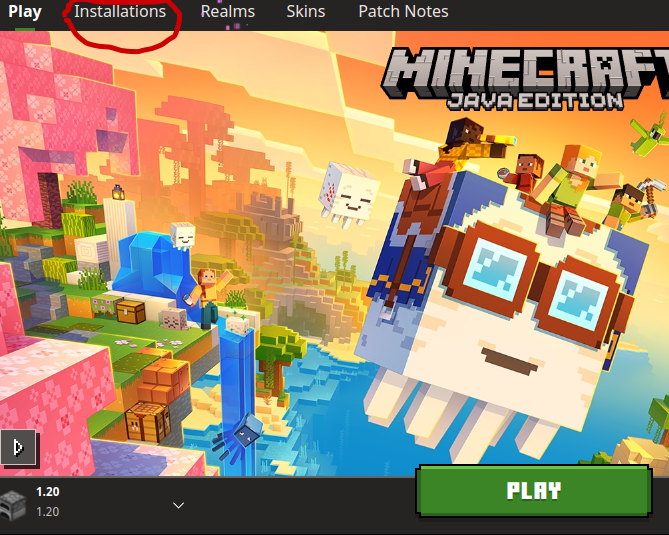
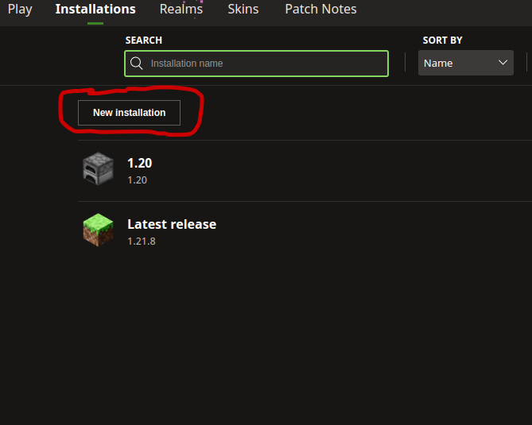
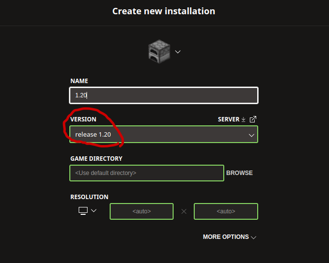

# MineROS relase 1.0 documentation
MineROS allows the user to fully control a MC bot using ROS services and topics, The current version of MineROS is made for ROS2 Humble and is still in development. The purpose of this project is to give a conducive learning environment for people who want to learn ROS2 and python. Specifically for people who want to learn mavros, as this is what the project attempts to mock.

## Dependencies
- ROS2 Humble
- Python3
- Nodejs version >= 20
- Mineflayer Api
- Minecraft version = 1.20

## Installation
### Install correct minecraft version
In the minecraft launcher
<p align="center">
  
  
  
</p>

### Clone repo
```bash
git clone git@github.com:AscendNTNU/mineros.git --recursive
```
All commands should be run from the root of this repo.

### Install nodejs
Check if node is already installed
```shell
node -v
```
If it is below v20, remove it:
```shell
sudp apt remove nodejs --autoremove
```
Then install the correct version
```shell
curl -fsSL https://deb.nodesource.com/setup_20.x | sudo -E bash -
sudo apt install -y nodejs
# Verify correct version:
node -v   # should show v20.x
npm -v    # should be avove 9.0
```

### Install npm packages
```shell
cd src/mineros-js
npm install mineflayer-collectblock rclnodejs
cd -
``` 

### Building the MineROS bot
1) Generate the javascript ROS message interface
```shell
cd src/mineros-js
npx generate-ros-messages
cd -
```
2) Build the ROS packages:
```shell
colcon build --symlink-install
# When developing, symlink makes it so we don't need to build every time we change a file.
# This does not apply to C++ files as they need to be compiled
```

## Running
Make sure a minecraft server is running on localhost:25565
Source the workspace:
```shell
source install/setup.sh
```
Then launch the mineros bot
```shell
ros2 launch mineros-js bot.launch.py
```
Then launch your own script to control the bot. For example, in a new shell run:
```shell
source install/setup.sh
ros2 launch my_first_package main.launch.py
```
The my_first_package is where you'll be creating your ROS nodes.
See the [README](src/my_first_package/README.md).
___
## API doc
Following is general api information and links to api docs.

### Minecraft data
```
IMPORTANT: BLOCKS DO NOT HAVE THE SAME IDS AS ITEMS
```

#### Block ids
Several of the services and topics require knowledge of the minecraft block ids, this can be found here REMEBER TO SELECT THE CORRECT MINECRAFT VERSION: 1.20 http://prismarinejs.github.io/minecraft-data/?d=blocks

#### Item ids
on the boot up of the MineROS system all item ids are written to the file ` docs/items.txt `. Note that blocks dont have the same id as items

### Links to API docs
- [Movement](docs/movement.md)
- [Navigation](docs/navigation.md)
- [Mining](docs/mining.md)
- [Building](docs/building.md)
- [Furnace](docs/furnace.md)
- [Crafting](docs/crafting.md)